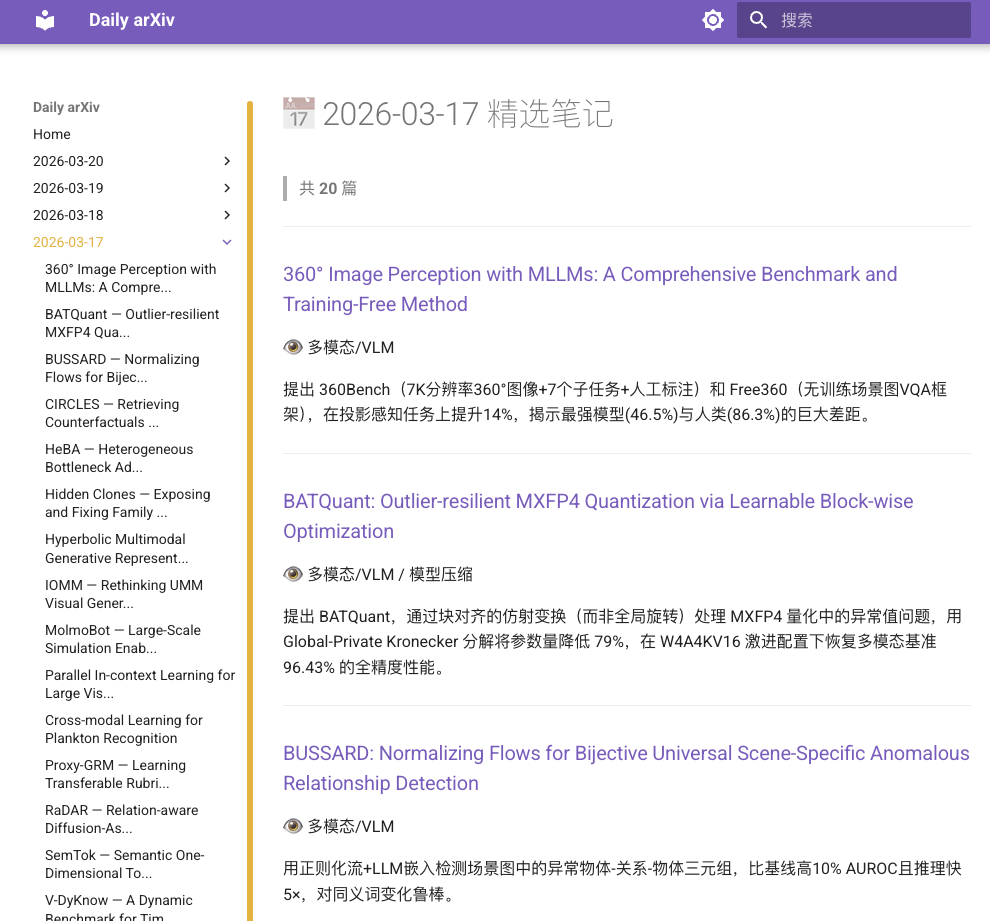
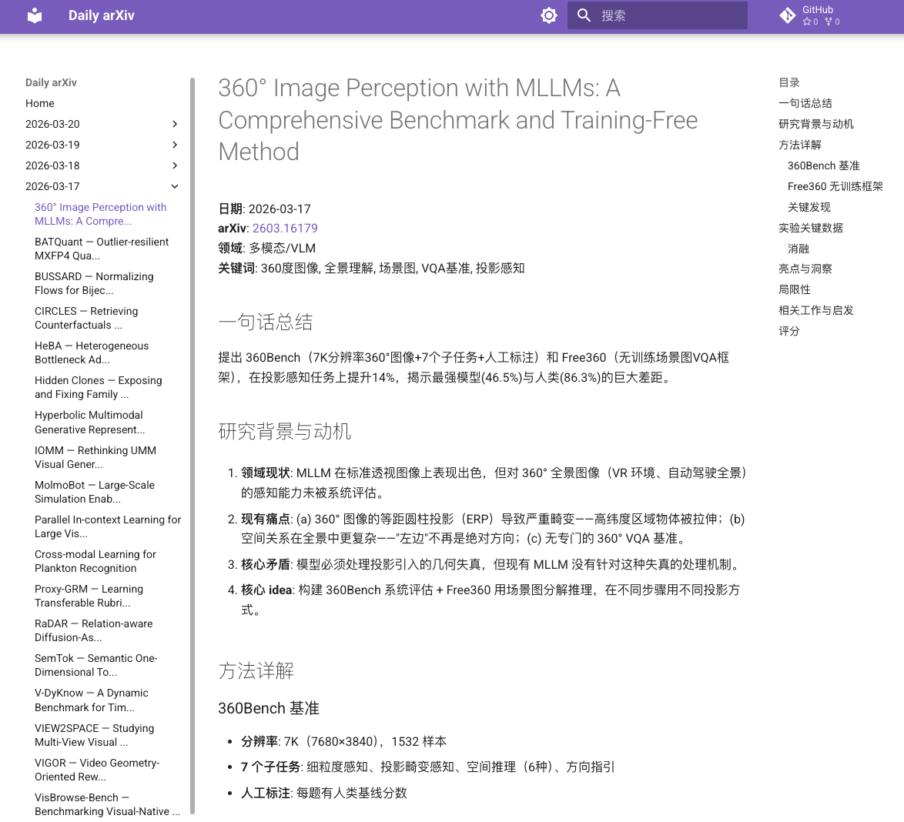

# Daily arXiv Tool 🚀

自动追踪 arXiv 每日新论文，定制你的研究雷达。

**Demo**: [zhuzhanshi.github.io/daily-arxiv-tool](https://zhuzhanshi.github.io/daily-arxiv-tool/)

**每日精选一览**



**论文深度解读**




## 特色

- **聊天驱动** — 在 VS Code 聊天框用自然语言指挥 AI，全程无需写代码、无需记命令
- **可定制** — 一个 YAML 文件配置你关注的 arXiv 类别、研究领域、评分关键词
- **智能筛选** — 多维评分（团队 + 关键词 + 领域权重 + 代码可用性），每天从 400+ 篇中精选 20 篇
- **28 个 AI 子领域** — 自动分类到 CV/NLP/LLM/多模态/机器人等细分领域
- **一键部署** — mkdocs-material 站点 + GitHub Actions + GitHub Pages

## 工作流演示

配置一次，之后只需在聊天框说话：

```
👤 帮我抓 3 月 19 号的 arxiv 论文

🤖 ✅ 获取了 387 篇论文，筛选出 A 档 20 篇，已生成速览页面。
   热门领域: 🧠 LLM推理 (4篇) | 🧩 多模态 (3篇) | 🎨 图像生成 (3篇)
```

```
👤 下载全文，然后把 A 档 20 篇笔记都写了

🤖 📥 下载 20 篇论文全文到缓存...
   ✍️ 开始写笔记 [1/20] FlowMatch-3D — 3D视觉 ...
   ✍️ [2/20] ReasonTree — LLM推理 ...
   ...
   ✅ 20 篇论文笔记全部完成！
```

```
👤 发布到博客

🤖 🔄 重建导航 → 构建站点 → 验证通过
   ✅ 已准备好，建议 commit message: "daily: 2026-03-19 (20 papers)"
   请检查后执行: git add -A && git commit && git push
```

```
👤 这篇 VLM 的论文有什么可以延伸的 idea？

🤖 💡 Idea 1: 将视觉指令微调迁移到视频理解...
   💡 Idea 2: 用 LoRA 替代全量微调降低训练成本...
   已保存到 ideas/multimodal_vlm/20260319_xxx.md
```

## 快速开始

### 1. 安装

```bash
git clone https://github.com/zhuzhanshi/daily-arxiv-tool
cd daily-arxiv-tool
pip install -r requirements.txt
```

### 2. 配置

编辑 `config.yaml`，选择你关注的领域（默认覆盖 AI 全领域，大部分人不用改）。

### 3. 开始使用

Skills 已经在 `.github/skills/` 下，clone 后即可用，无需额外复制。

在 VS Code 聊天框输入：

| 你说 | AI 做什么 |
|------|-----------|
| "刷今天的 daily arxiv" | 获取论文 → 筛选评分 → 生成速览页面 |
| "把今天的 A 档解读都写了" | 下载全文 → 批量写 20 篇深度解读 |
| "帮我读这篇论文 2603.12886" | 获取全文 → 写一篇 100+ 行论文解读 |
| "这篇论文能延伸什么 idea" | 分析论文 → 生成 1-3 个研究想法 |
| "发布 daily" | 重建导航 → 构建验证 → 准备提交 |
| "预览站点" | 启动本地 mkdocs 服务器 |

## Skills

`.github/skills/` 目录包含 5 个 AI Skill —— 每个是一份结构化的指令模板，AI 助手读取后就知道如何完成对应任务：

| Skill | 触发词 | 功能 |
|-------|--------|------|
| **fetch-papers** | "刷 daily"、"抓论文" | 获取 arXiv 论文 → 筛选评分 → 生成速览页面 |
| **write-note** | "读论文"、"写解读" | 获取论文全文 → 写 100+ 行结构化论文解读 |
| **write-note-batch** | "批量写解读" | 一口气写完当天所有 A 档论文解读 |
| **gen-idea** | "想 idea"、"brainstorm" | 分析论文 → 生成可行的研究想法 |
| **publish-site** | "发布"、"更新站点" | 重建导航 → 构建站点 → 准备 git 提交 |

> Skills 本质上是 **prompt 工程** —— 告诉 AI「遇到这类请求时，应该依次执行哪些步骤、调用哪些脚本、按什么模板输出」。你不需要理解实现细节，只需在聊天框说话。

## 配置

编辑 `config.yaml` 定制所有行为，**不需要改一行代码**:

```yaml
# 追踪的 arXiv 类别
categories:
  - cs.CV   # Computer Vision — 计算机视觉
  - cs.CL   # Computation and Language — NLP/LLM
  - cs.AI   # Artificial Intelligence — AI 通用
  - cs.LG   # Machine Learning — 机器学习

# 筛选配置
filter:
  focus_domains:           # 关注领域（空 = 全部）
    - multimodal_vlm
    - llm_reasoning
    - image_generation
  top_a: 20                # A 档精选数量
  top_b: 40                # B 档数量
  teams: ["google", "openai", "tsinghua"]  # 加分团队

# 网络
network:
  proxy: ""                # 代理（留空 = 直连）
```

完整配置参考 [config.yaml](config.yaml)。

### 自定义领域

内置 28 个 AI 子领域。你还可以添加自定义领域：

```yaml
domains:
  quantum_computing:
    name: "量子计算"
    emoji: "⚛️"
    keywords: ["quantum comput", "qubit", "quantum circuit"]
    priority: 5
```

## 内置领域

| 领域 | Emoji | 关键词示例 |
|------|-------|-----------|
| 多模态/VLM | 🧩 | vision-language, vlm, multimodal |
| LLM推理 | 🧠 | chain-of-thought, reasoning |
| LLM Agent | 🦾 | llm agent, tool use, agentic |
| 图像生成 | 🎨 | diffusion, text-to-image |
| 视频理解 | 🎬 | video generation, action recogn |
| 3D视觉 | 🧊 | gaussian splat, nerf, point cloud |
| 模型压缩 | 📦 | quantiz, pruning, distill |
| 机器人 | 🤖 | robot, embodied, grasp |
| ... | | 共 28 个领域 |

## 架构

```
用户（聊天框说话）
    │
    ▼
AI Skills (.github/skills/)          ← 交互层: 自然语言 → 结构化工作流
    │
    ▼
Python 脚本 (src/)                   ← 执行层: arXiv API / 分类 / 筛选 / 页面生成
    │
    ▼
数据 (logs/ + paper_cache/ + notes/) ← 输出层: JSON / 论文缓存 / mkdocs 页面
    │
    ▼
GitHub Pages (mkdocs-material)       ← 展示层: 自动部署的静态站点
```

### 数据流

```
arXiv API → fetch.py → logs/daily_YYYY-MM-DD.json       (~400 篇/天)
                │
                ├→ filter.py → logs/filtered_YYYY-MM-DD.json  (A档20 + B档40)
                │
                ├→ page.py → notes/YYYY-MM-DD/index.md        (速览页面)
                │
                ├→ download.py → paper_cache/arxiv/YYYY-MM-DD/ (论文全文)
                │
                └→ write-note skill → notes/YYYY-MM-DD/*.md   (深度解读)
```

### 评分维度

| 维度 | 分值 | 规则 |
|------|------|------|
| 领域权重 | 0-15 | VLM/推理=15, Agent/效率=13-14, 其他=11-12 |
| 团队知名度 | 0-15 | 作者匹配团队关键词，每命中+5 |
| 高价值关键词 | 0-30 | "SOTA"/"benchmark"等，每命中+3 |
| 有代码 | 0-5 | github.com / "code available" |
| 摘要长度 | 0-10 | >150词+5, >250词+5 |
| 低价值惩罚 | -10 | "survey of" / "position paper" |

## GitHub Actions 自动化

- **daily.yml** — 工作日自动抓取论文 + 生成页面 + 提交
- **deploy.yml** — notes/ 更新时自动部署 GitHub Pages

启用：Settings → Pages → Source 选 "GitHub Actions"。

## CLI（可选）

日常用聊天即可，也可以直接终端运行：

```bash
cd src && python cli.py run 2026-03-20       # fetch → filter → page
cd src && python cli.py fetch 2026-03-20     # 获取论文
cd src && python cli.py filter 2026-03-20    # 筛选评分
cd src && python cli.py download 2026-03-20  # 下载全文
cd src && python cli.py serve                # 本地预览
```

## 项目结构

```
daily-arxiv-tool/
├── config.yaml             # 配置（arXiv类别/领域/评分规则/网络）
├── mkdocs.yml              # 站点配置
├── requirements.txt        # Python 依赖
├── CLAUDE.md               # Claude Code 项目指令
├── AGENTS.md               # AI 代理项目指令（跨编辑器通用）
├── src/                    # Python 脚本
│   ├── fetch.py            #   arXiv API 获取
│   ├── classify.py         #   28 领域分类规则
│   ├── filter.py           #   多维评分筛选
│   ├── page.py             #   mkdocs 页面生成
│   ├── download.py         #   论文下载 + HTML清洗
│   ├── config.py           #   YAML 配置加载
│   ├── network.py          #   代理/SSL/限速
│   └── cli.py              #   CLI 入口
├── .github/
│   ├── skills/             # ⭐ AI Skills（聊天交互界面）
│   │   ├── fetch-papers/        获取+筛选+生成页面
│   │   ├── write-note/          读论文写解读笔记
│   │   ├── write-note-batch/    批量写论文解读
│   │   ├── gen-idea/            从论文生成研究idea
│   │   └── publish-site/        发布到 GitHub Pages
│   └── workflows/          # GitHub Actions (daily + deploy)
├── notes/                  # 论文解读（自动生成）
├── logs/                   # JSON 数据（自动生成）
└── paper_cache/            # 论文缓存（自动生成）
```

## License

[MIT](LICENSE)
